# IITG Hospital & Ambulance Management System

## Project Images

1. **Website Landing Page**  
   

2. **Hiring Ambulance Form**  
   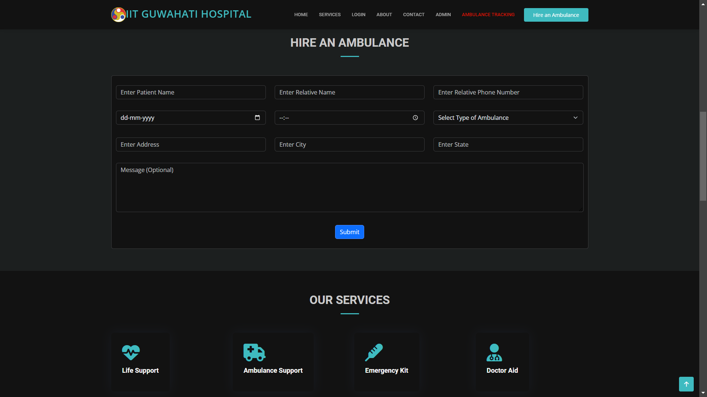

3. **Hospital Logins For Users and Doctor**  
   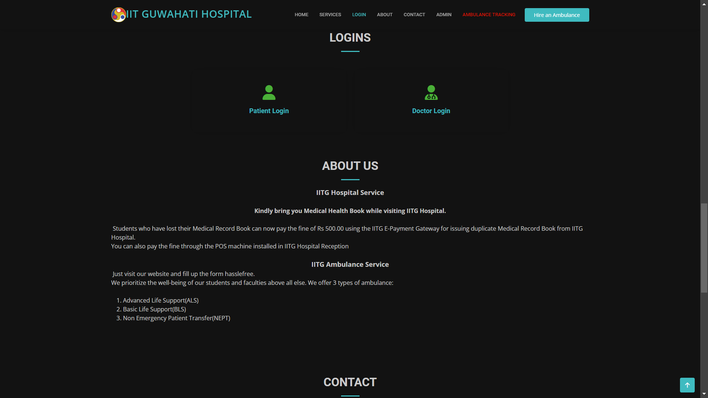

4. **Query Form & Admin Logins**  
   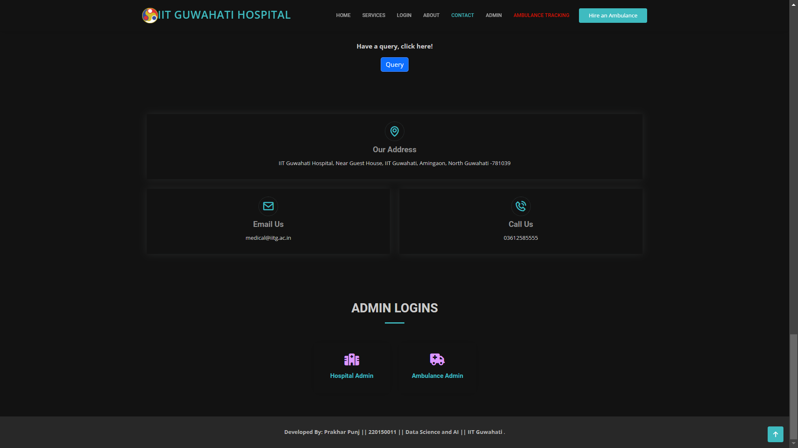

5. **Ambulance Tracking Info**  
   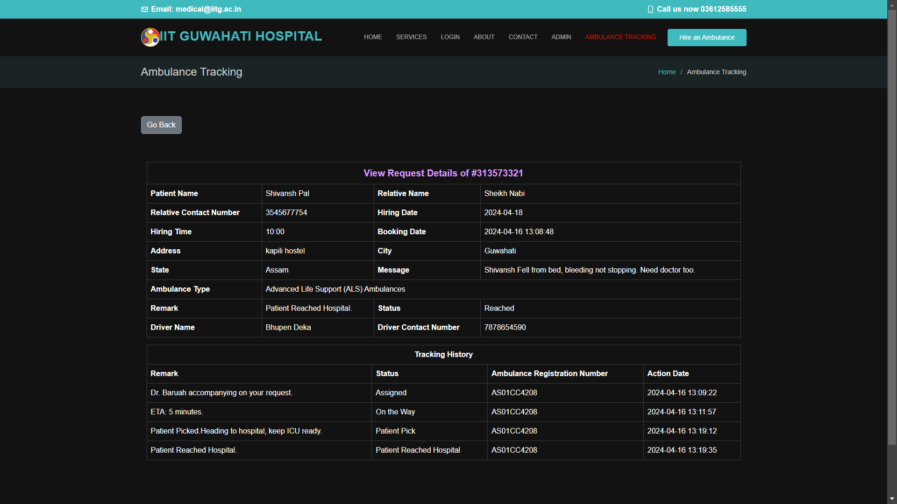

6. **User Login Page**  
   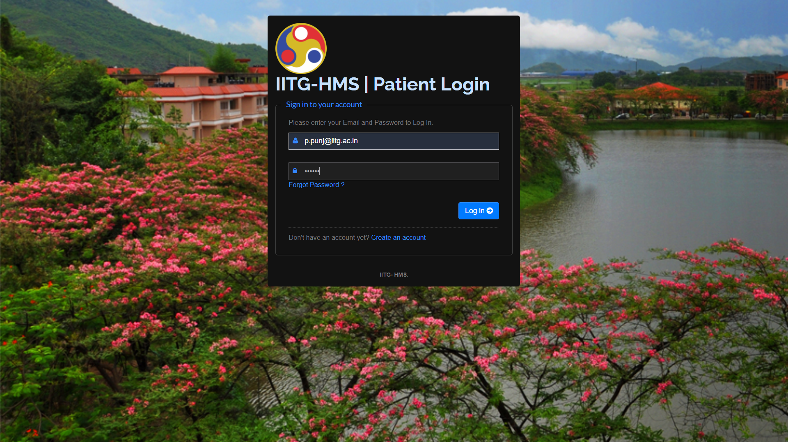

7. **User Dashboard**  
   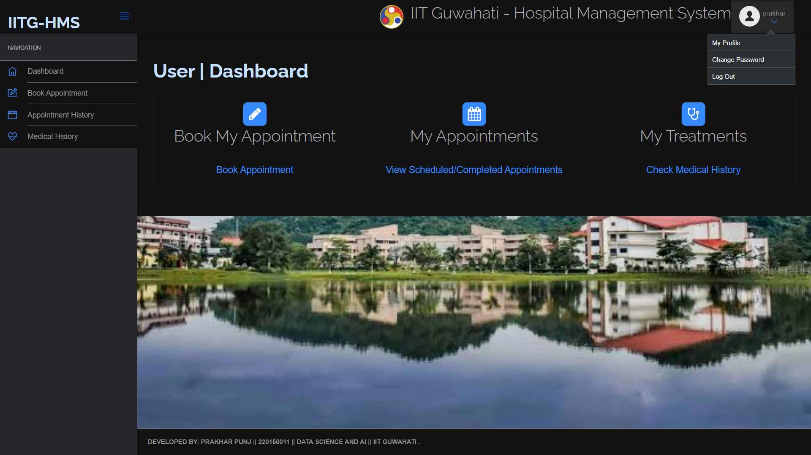

8. **User Complete Medical History**  
   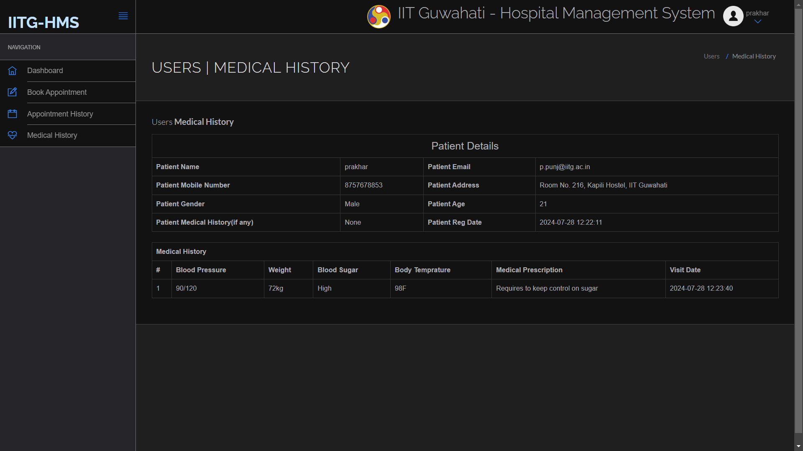

9. **Doctor Dashboard**  
   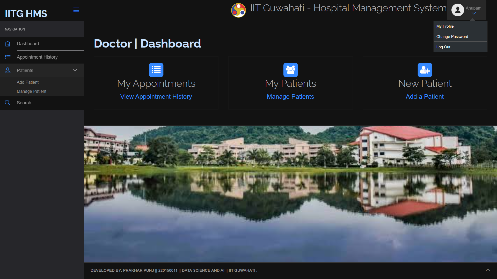

10. **Doctor's Patient History View**  
    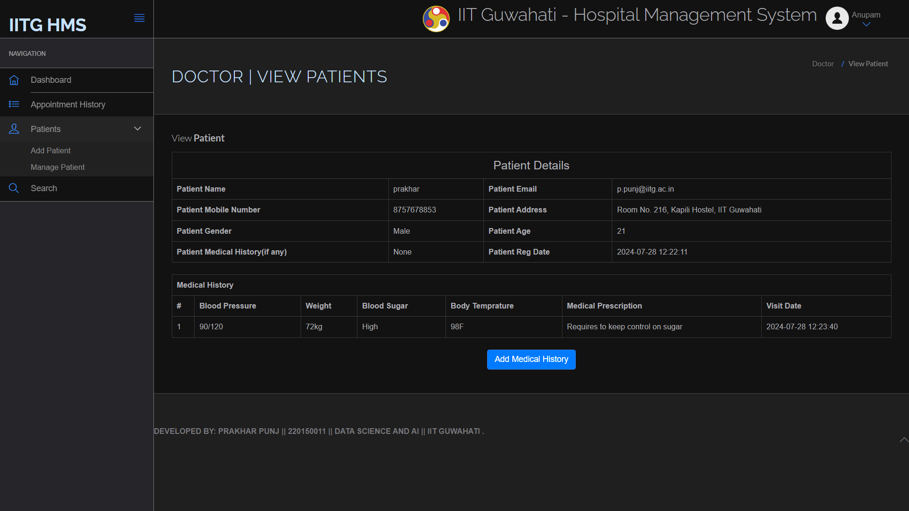

11. **Doctor Adding Patient's Medical History**  
    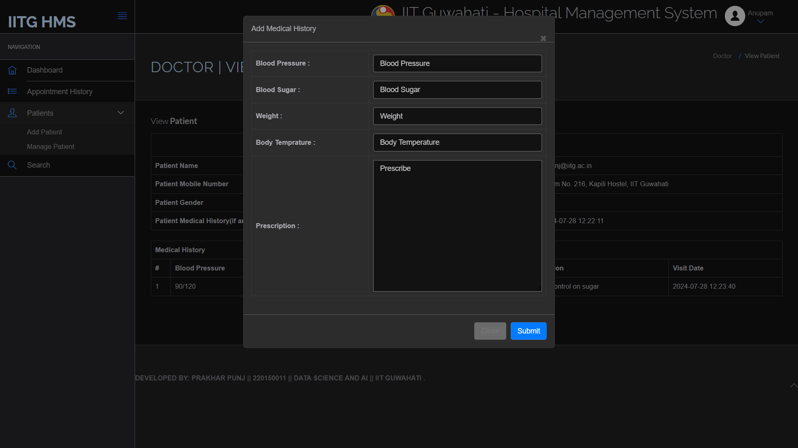

12. **Hospital Admin Dashboard**  
    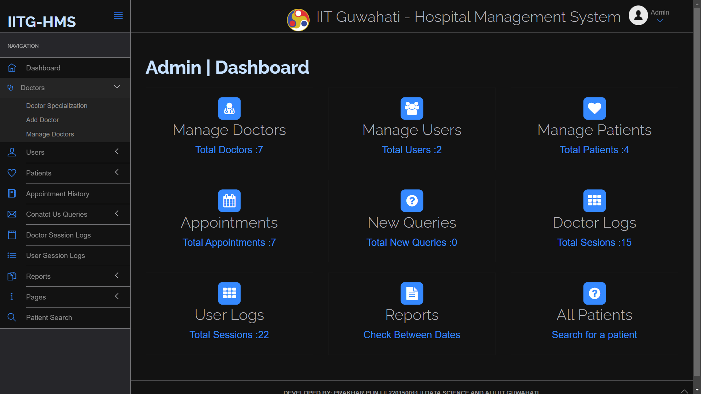

13. **Hospital Admin Editing Doctor's Profile**  
    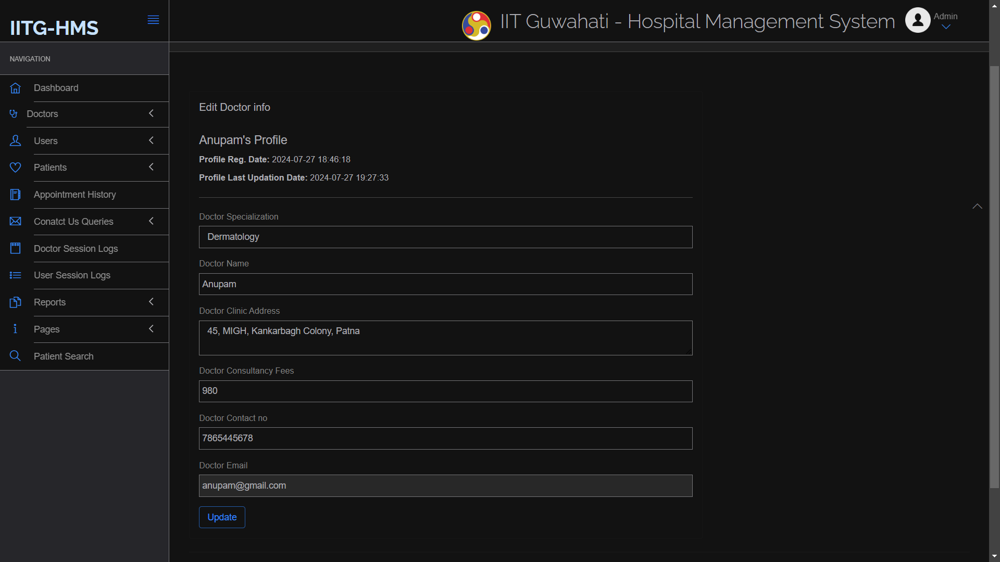

14. **Ambulance Admin Sign In**  
    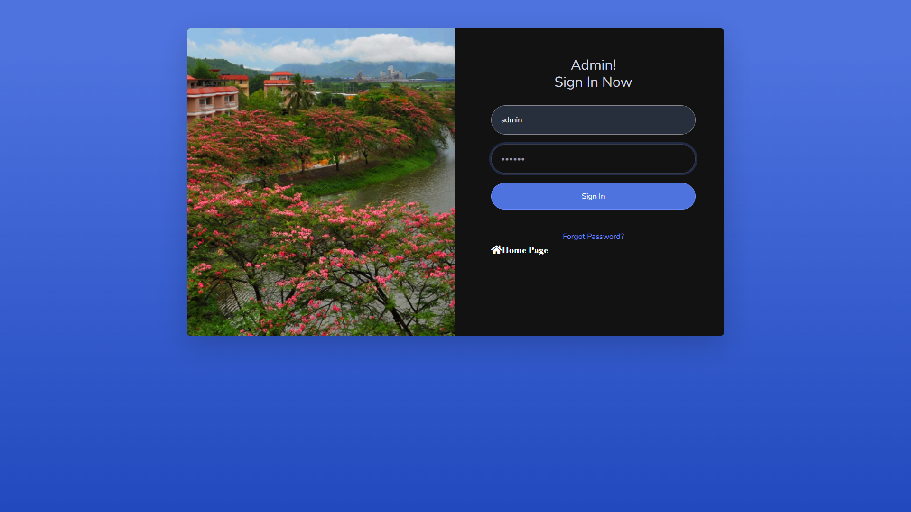

15. **Ambulance Admin Dashboard**  
    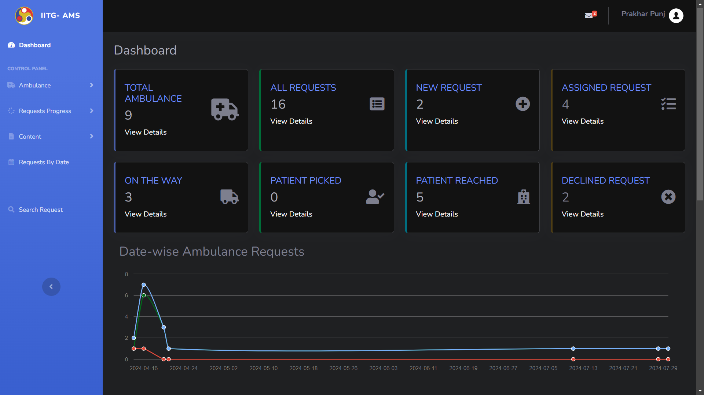

16. **Ambulance Admin All Requests View and New Requests View**  
    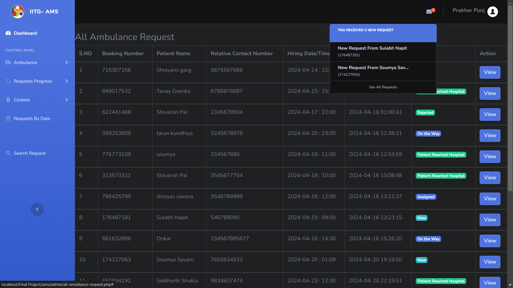

## Instructions to Run the Project

1. **Download the project zip file.**

2. **Extract the file and copy the `final` folder.**

3. **Paste the folder inside the root directory:**
   - For XAMPP: `xampp/htdocs`
   - For WAMP: `wamp/www`
   - For LAMP: `var/www/html`

4. **Open PHPMyAdmin by navigating to [http://localhost/phpmyadmin](http://localhost/phpmyadmin) in your web browser.**

5. **Create a database with the name `final`.**

6. **Import the `final.sql` file:**
   - Copy the contents of `final.sql`.
   - Paste the contents into the SQL Query section in PHPMyAdmin to create the database.

7. **Run the script by navigating to [http://localhost/Final Project](http://localhost/Final Project) in your web browser.**

## Credentials to Use

### Ambulance Admin Credential
- **Username:** admin
- **Password:** 123456

### Hospital Admin Credential
- **Username:** admin
- **Password:** 123456

### Doctor Credential
- **Email:** anupam@gmail.com
- **Password:** 123456

### Patient Credential
- **Email:** p.punj@iitg.ac.in
- **Password:** 123456
