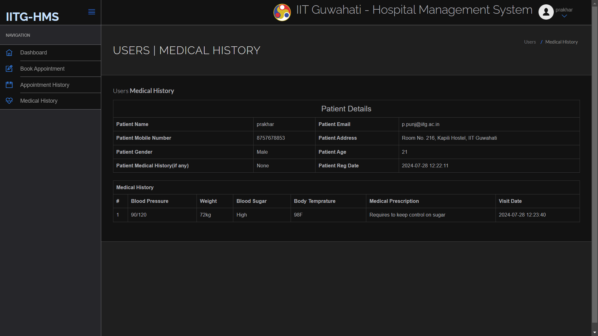

# IITG Hospital & Ambulance Management System

## Project Images


1. Website Landing Page
2. HIring Ambulance Form
3. Hospital Logins For Users and Doctor
4. Query Form & Admin Logins
5. Ambulance Tracking Info
6. User Login Page
7. User DashBoard
8. User Complete Medical History
9. Doctor Dashboard
10. Doctor's Patient History View
11. Doctor Adding Patient's Medical History
12. Hospital Admin DashBoard
13. Hospital Admin Editing Doctor's Profile
14. Ambulance Admin Sign In
15. Ambulance Admin DashBoard
16. Ambulance Admin All Requests View and New Requests view


## Instructions to Run the Project

1. Download the project zip file.

2. Extract the file and copy the `final` folder.

3. Paste the folder inside the root directory:
   - For XAMPP: `xampp/htdocs`
   - For WAMP: `wamp/www`
   - For LAMP: `var/www/html`

4. Open PHPMyAdmin by navigating to [http://localhost/phpmyadmin](http://localhost/phpmyadmin) in your web browser.

5. Create a database with the name `final`.

6. Import the `final.sql` file:
   - Copy the contents of `final.sql`.
   - Paste the contents into the SQL Query section in PHPMyAdmin to create the database.

7. Run the script by navigating to [http://localhost/Final Project](http://localhost/Final Project) in your web browser.

## Credentials to Use

### Ambulance Admin Credential
- **Username:** admin
- **Password:** 123456

### Hospital Admin Credential
- **Username:** admin
- **Password:** 123456

### Doctor Credential
- **Email:** anupam@gmail.com
- **Password:** 123456

### Patient Credential
- **Email:** p.punj@iitg.ac.in
- **Password:** 123456


### Hospital and Ambulance Management System

#### Project Overview

The Hospital and Ambulance Management System (HAMS) is a comprehensive full-stack solution aimed at modernizing the outdated IT system at IIT Guwahati's hospital. The project addresses the inefficiencies in ambulance dispatch and hospital record management by leveraging PHP for back-end operations, HTML, CSS, and JavaScript for the front-end, and MySQL for the database. The front-end website uses the Medicio template, while the hospital admin dashboard is built with the Clip-Two template.

#### Key Features

##### Ambulance Management System

1. **Ambulance Request Form**:
   - **Accessibility**: Available to the IITG community.
   - **Fields**: Relative name, patient name, location, contact numbers, date, time, and type of service (Basic Life Support, Advanced Life Support, Non-Emergency Patient Transfer).
   - **Form Handling**: Implemented using PHP to handle `$_POST` data.
   ```php
   if ($_SERVER["REQUEST_METHOD"] == "POST") {
       $relative_name = $_POST['relative_name'];
       $patient_name = $_POST['patient_name'];
       // Additional fields...
   }
   ```

2. **User Journey**:
   - **Request Submission**: Users fill out the form to request an ambulance.
   - **Admin Review**: Admin can approve or deny the request based on the availability and situation.
   - **Information Update**: Upon approval, details such as the ambulance driver’s name, phone number, and registration number are sent to the user.
   - **Stages**:
     - **Request Approval/Denial**: Managed by the admin.
     - **Ambulance Dispatch**: Admin updates the status to "on the way".
     - **Patient Pickup**: Admin updates when the patient is picked up.
     - **Arrival at Hospital**: Admin updates when the ambulance reaches the hospital.
   - **Logging System**: Maintains all remarks and conversations for transparency.

3. **Admin Dashboard**:
   - **Dashboard Features**: Total requests, fulfilled or declined requests, ambulances en route, daily data updates.
   - **Ambulance Management**: Add/remove ambulances, edit details, generate reports using MySQL queries.
   - **Example MySQL Query**:
   ```sql
   SELECT * FROM requests WHERE date BETWEEN '2023-01-01' AND '2023-12-31';
   ```

4. **Technical Implementation**:
   - **Form Handling**: Uses PHP's GET and POST methods for form data submission.
   - **Database Interactions**: MySQLi is used for CRUD operations.
   - **Session Management**: Implemented with PHP sessions.
   ```php
   session_start();
   if (!isset($_SESSION['user_id'])) {
       header("Location: login.php");
   }
   ```
   - **JavaScript**: Used for form validation and dynamic updates.
   - **Responsive Interface**: Built with the SB Admin 2 Bootstrap template.

##### Hospital Management System

1. **User Interface**:
   - **User Accounts**: Users can create accounts, book appointments, view medical history, and manage bookings.
   - **Appointment Booking**: Triggers notifications for both users and doctors.
   - **User vs Patient**: A user becomes a patient upon doctor registration.

2. **Doctor Interface**:
   - **Patient Records**: Update patient records with prescriptions, vitals (BP, blood sugar, temperature, weight), and medical remarks.
   - **Access Control**: Only admin-assigned credentials allow doctor access to ensure data security.
   - **Example PHP for Secure Access**:
   ```php
   session_start();
   if (!isset($_SESSION['doctor_id'])) {
       header("Location: login.php");
   }
   ```

3. **Admin Interface**:
   - **Central Control**: Manage user and doctor accounts, appointment logs, and queries.
   - **Admin Functions**: Add specializations, manage doctor details, reset passwords.
   - **Dashboard Statistics**: Total doctors, users, patients, appointments, and logs.
   - **Report Generation**: Reports for specified date ranges showing detailed appointment histories.
   - **Example MySQL Query for Reports**:
   ```sql
   SELECT * FROM appointments WHERE date BETWEEN '2023-01-01' AND '2023-12-31';
   ```

4. **Technical Implementation**:
   - **PHP Sessions**: Used for user authentication and maintaining login states.
   - **MySQL**: Persistent data storage with tables for users, doctors, appointments, and logs.
   - **Secure Password Management**: Using PHP’s `password_hash()` function.
   ```php
   $hashed_password = password_hash($password, PASSWORD_DEFAULT);
   ```
   - **Data Validation and Sanitization**: Prevent SQL injection and XSS attacks.

5. **Forgot Password Feature**:
   - **Workflow**: User enters email, checks if it exists in the database, and then resets the password.
   - **Example Code**:
   ```php
   if ($_SERVER["REQUEST_METHOD"] == "POST") {
       $email = $_POST['email'];
       $result = $conn->query("SELECT * FROM users WHERE email='$email'");
       if ($result->num_rows > 0) {
           // Send reset link
       } else {
           echo "Email not found";
       }
   }
   ```

#### Conclusion

This project addresses the critical needs of modernizing the hospital and ambulance management system at IIT Guwahati. By leveraging a full stack approach with PHP, HTML, CSS, JavaScript, and MySQL, the system ensures efficient ambulance dispatch, secure data handling, and a user-friendly interface for both hospital staff and patients. The use of templates like Medicio and Clip-Two ensures a responsive and aesthetically pleasing design, while robust back-end functionality ensures reliability and security.

